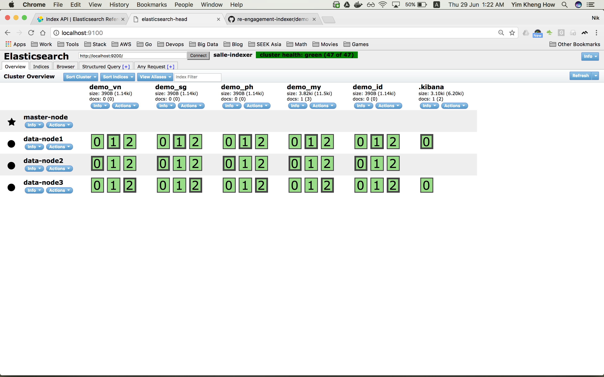

## ElasticSearch Demo Setup
This folder intended for a quickstart for people to get started with understanding the ElasticSearch, as well as eventually contribute to this project to make it better.

### ElasticSearch development environment with Docker
#### Docker
Docker is a very convenient tools such that it can easily simulate the infrastructure system integration for the project you are working on, and hence better development environment. With docker, you can setup elasticsearch engine in no time.
#### ElasticSearch
ElasticSearch is a distributed, RESTful search and analytics engine. ElasticSearch comes with no interface. You communicate with it through an HTTP API. Hence, we need some web UI plugin to make it easier to visualize

- ElasticSearch Head
- Kibana

_Notice: Most web UI plugin require CORS support to be turn on, hence you need to enabled it as shown in the es-{node_type}.yml in this folder_

### How to setup
Spin up the demo environment:
```bash
docker-compose up -d
# Checkout the cluster health and make sure status green before run the next command
/bin/bash create-index.sh
```

Browse to http://localhost:9100


Shut down the demo environment:
```bash
docker-compose down
rm -rf data*
```

***Make sure your docker-machine have at least 4GB memory in order for this demo stack to work properly***
